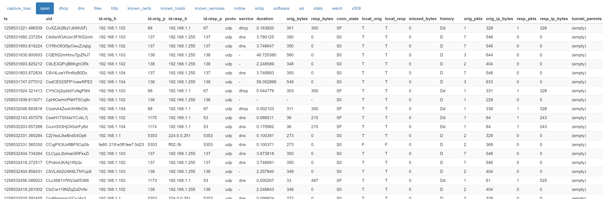

[TOC]

### 练习
现在我们已经掌握了Bro脚本语言的所有基本概念。 要完成您的Bro语言旅程的第一部分，请完成以下练习。

考虑以下列出的子网作为给定的本地子网：
192.168.1.0/24, 192.68.2.0/24, 172.16.0.0/20, 172.16.16.0/20, 172.16.32.0/20, 172.16.48.0/20.
写一个脚本：

* 找出前10个新连接源IP和端口，目标IP和端口，连接ID，连接开始的时间。
* 统计所有看到的连接并最终打印出来。
* 打印出每个唯一的IP地址，如果它是本地或外部的。

要解决此练习，请加载流量示例exercise_traffic.pcap。
** 注意，下面的示例均使用了[exercise_traffice.pcap](pcapFiles/exercise-traffic.pcap)文件，运行使用
```
script.bro -C -r exercise_traffice.pcap
```

#### 显示所有网络连接 
```
event bro_init()
	{
	print "use all the Bro types";
  
	}
event new_connection(c: connection)
   {
   print fmt("New Connection =>uid:%s orig: %s %s resp: %s %s", c$uid,c$id$orig_h, c$id$orig_p, c$id$resp_h, c$id$resp_p); 
   } 

event bro_done()
	{
	print "and tell me what you learned";
	}

```
pcap部分连接的完整字段


脚本运行结果
```
use all the Bro types
New Connection =>uid:CYZ1U2YlweviwBpsi orig: 192.168.1.1 626/udp resp: 224.0.0.1 626/udp
New Connection =>uid:CRoySYoAdQe1vbov2 orig: 192.168.1.102 68/udp resp: 192.168.1.1 67/udp
New Connection =>uid:Cz2gk812zghIV4m13i orig: 192.168.1.103 138/udp resp: 192.168.1.255 138/udp
New Connection =>uid:CC86it3vQ7FNZcuVcf orig: 192.168.1.103 137/udp resp: 192.168.1.255 137/udp
New Connection =>uid:CjdU7V3q81spa4Iw8b orig: 192.168.1.102 137/udp resp: 192.168.1.255 137/udp
New Connection =>uid:CE2OLg3qNY7iXHBpSd orig: 192.168.1.102 138/udp resp: 192.168.1.255 138/udp
New Connection =>uid:CmDpkBDD6VN5TSHM3 orig: 192.168.1.104 138/udp resp: 192.168.1.255 138/udp
[...]
```

#### 如何打印前10条连接
** 注意体会事件触发，event new_connection(c: connection) 本身相当于一个while条件语句了，它的意思是当发生这个事件时

```
event bro_init()
	{
	print "use all the Bro types";
  
	}
global i=0;
event new_connection(c: connection)
   {
      ++i;
      if(i<11)
      {
       print fmt("New Connection =>uid:%s orig: %s %s resp: %s %s", c$uid,c$id$orig_h, c$id$orig_p, c$idsu$resp_h, c$id$resp_p); 
      }
   }


event bro_done()
	{
	print "and tell me what you learned";
	}

```
output
```
use all the Bro types
New Connection =>uid:CC57Qz4OqB4qdBFN6j orig: 192.168.1.1 626/udp resp: 224.0.0.1 626/udp
New Connection =>uid:C5E4MJ1eTQITcFrEAc orig: 192.168.1.102 68/udp resp: 192.168.1.1 67/udp
New Connection =>uid:CXOMFf4vWYa8iR9rqe orig: 192.168.1.103 138/udp resp: 192.168.1.255 138/udp
New Connection =>uid:CwyXMa191qpbWr6Mv2 orig: 192.168.1.103 137/udp resp: 192.168.1.255 137/udp
New Connection =>uid:CmR4se3v9PIwf2M7Te orig: 192.168.1.102 137/udp resp: 192.168.1.255 137/udp
New Connection =>uid:CJ7QMK1LIUgbjLPmk1 orig: 192.168.1.102 138/udp resp: 192.168.1.255 138/udp
New Connection =>uid:Ck74Xm1xWLqda39dPl orig: 192.168.1.104 138/udp resp: 192.168.1.255 138/udp
New Connection =>uid:CXW7Gb9ere7Rc4nLb orig: 192.168.1.104 137/udp resp: 192.168.1.255 137/udp
New Connection =>uid:Cje7gS3EILPU3b1QO1 orig: 192.168.1.103 68/udp resp: 192.168.1.1 67/udp
New Connection =>uid:CbHA2KR0chK5VvKmj orig: 192.168.1.102 138/udp resp: 192.168.1.255 138/udp
and tell me what you learned
```

#### 如何打印唯一的IP，使用set
```
event bro_init()
	{
	print "use all the Bro types";
  
	}

global addrs:set[addr];
event new_connection(c: connection)
   {
    add addrs[c$id$orig_h];
   }


event bro_done()
	{
	print "and tell me what you learned";
	for(ip in addrs)
	    {
	        print ip;
    	}
    }

```
```
use all the Bro types
and tell me what you learned
fe80::219:e3ff:fee7:5d23
192.168.1.102
192.168.1.1
192.168.1.105
192.168.1.104
0.0.0.0
192.168.1.103
169.254.225.22
fe80::2c23:b96c:78d:e116
255.255.255.255
```

### 找出内网IP
```
event bro_init()
	{
	print "use all the Bro types";
  
	}

global addrs:set[addr];
global intranet:vector of subnet ={192.168.1.0/24, 192.68.2.0/24, 172.16.0.0/20, 172.16.16.0/20, 172.16.32.0/20, 172.16.48.0/20};
event new_connection(c: connection)
   {
    add addrs[c$id$orig_h];
   }


event bro_done()
	{
	print "and tell me what you learned";
	for(ip in addrs)
	    {
	      for(net in intranet)
	      {
	          if(ip in intranet[net])
	          print fmt("%s is belongs to subnet %s",ip,intranet[net]);
	      }
    	}
    print intranet;
    }
```
```
use all the Bro types
and tell me what you learned
192.168.1.103 is belongs to subnet 192.168.1.0/24
192.168.1.102 is belongs to subnet 192.168.1.0/24
192.168.1.1 is belongs to subnet 192.168.1.0/24
192.168.1.104 is belongs to subnet 192.168.1.0/24
192.168.1.105 is belongs to subnet 192.168.1.0/24
[192.168.1.0/24, 192.68.2.0/24, 172.16.0.0/20, 172.16.16.0/20, 172.16.32.0/20, 172.16.48.0/20]
```