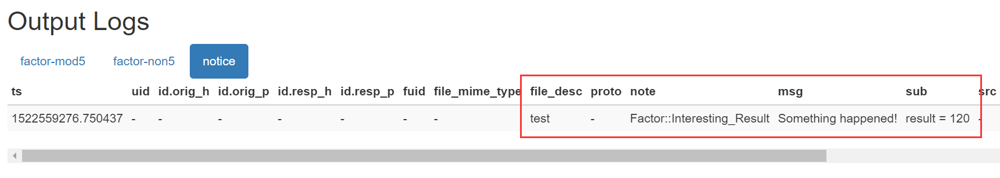

[TOC]

### 激发一个notice
定制Bro的最简单方法之一是编写当地通知策略。除了查看日志文件，您可以要求Bro向您发送电子邮件，无论是针对某种情况还是汇总的有关警告的摘要电子邮件等。此功能通过[通知框架](https://www.bro.org/sphinx/frameworks/notice.html)提供。

在本课中，我们从创建新通知开始。在Try.Bro中，通知只能写入日志文件。它不能发送电子邮件。请运行代码示例并查看新的日志文件。除了信息本身，它会告诉你通知的名称。这对汇总摘要尤其有用。

让我们看看代码。从factorial.bro开始。我们在导出部分添加一个新的通知类型值。对于这个例子，我们认为120是一个我们想要通知的有趣值。所以我们把它变成一个常量，可以在以后改变。现在可以要求factor模块发出通知。

在main.bro中，每次计算阶乘时，我们都会问这是否是一个有趣的结果。如果是这样，唤起通知。给出了msg和sub字段。你可以在那里放置任何文字，稍后将帮助你找出你需要的东西。通知框架可能有点混乱。如果你提醒自己这只是一个功能，它更容易处理。

通过通知框架发送电子邮件需要在系统上运行sendmail配置。本课应该让你从这个话题开始。请继续在本地Bro安装中尝试。

```
module Factor;

export {
    redef enum Log::ID += { LOG };
    #Append a new notice value to the Notice::Type enumerable.
    redef enum Notice::Type += { Interesting_Result };
    
    const interesting_result = 120 &redef;

    type Info: record {
        num:           count &log;
        factorial_num: count &log;
        };
    global factorial: function(n: count): count;
    global mod5: function(id: Log::ID, path: string, rec: Factor::Info) : string;
    global result : count  = 0;
    }

function factorial(n: count): count
    {
    if ( n == 0 )
        {
    	result = 1;
        return 1;
        }
    
    else
        {
    	result = n * factorial(n - 1);
        return result;
        }
    }
    
function mod5(id: Log::ID, path: string, rec: Factor::Info) : string    
    {
    if ( rec$factorial_num % 5 == 0 )
        return "factor-mod5";
    
    else
        return "factor-non5";
    }

```

```
@load factorial

event bro_init()
    {
    Log::create_stream(Factor::LOG, [$columns=Factor::Info, $path="factor"]);
    
    local filter: Log::Filter = [$name="split-mod5s", $path_func=Factor::mod5];
    Log::add_filter(Factor::LOG, filter);
    Log::remove_filter(Factor::LOG, "default");
    }

event bro_done()
    {
    local numbers: vector of count = vector(1, 2, 3, 4, 5, 6, 7, 8, 9, 10);    
    for ( i in numbers )
    	{
    	local result = Factor::factorial(numbers[i]);
        Log::write( Factor::LOG, [$num=numbers[i],
                                  $factorial_num=result]);
    	if ( result == Factor::interesting_result)
    		{
	    	NOTICE([$note=Factor::Interesting_Result,
	    	$file_desc="test",
    	 	$msg = "Something happened!",
        	$sub = fmt("result = %d", result)]);
    		}
    	}
    }


```
