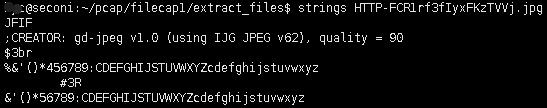

[TOC]

### 简介
strings命令主要用来将一个文件(任意类型的)中的可打印字符打印出来

```
SYNOPSIS
       strings [-afovV] [-min-len]
               [-n min-len] [--bytes=min-len]
               [-t radix] [--radix=radix]
               [-e encoding] [--encoding=encoding]
               [-] [--all] [--print-file-name]
               [-T bfdname] [--target=bfdname]
               [--help] [--version] file...

$ strings --help
Usage: strings [option(s)] [file(s)]
 Display printable strings in [file(s)] (stdin by default)
 The options are:
  -a - --all                Scan the entire file, not just the data section [default]
  -d --data                 Only scan the data sections in the file
  -f --print-file-name      Print the name of the file before each string
  -n --bytes=[number]       Locate & print any NUL-terminated sequence of at
  -<number>                   least [number] characters (default 4).
  -t --radix={o,d,x}        Print the location of the string in base 8, 10 or 16
  -o                        An alias for --radix=o
  -T --target=<BFDNAME>     Specify the binary file format
  -e --encoding={s,S,b,l,B,L} Select character size and endianness:
                            s = 7-bit, S = 8-bit, {b,l} = 16-bit, {B,L} = 32-bit
  @<file>                   Read options from <file>
  -h --help                 Display this information
  -v -V --version           Print the program's version number
```
